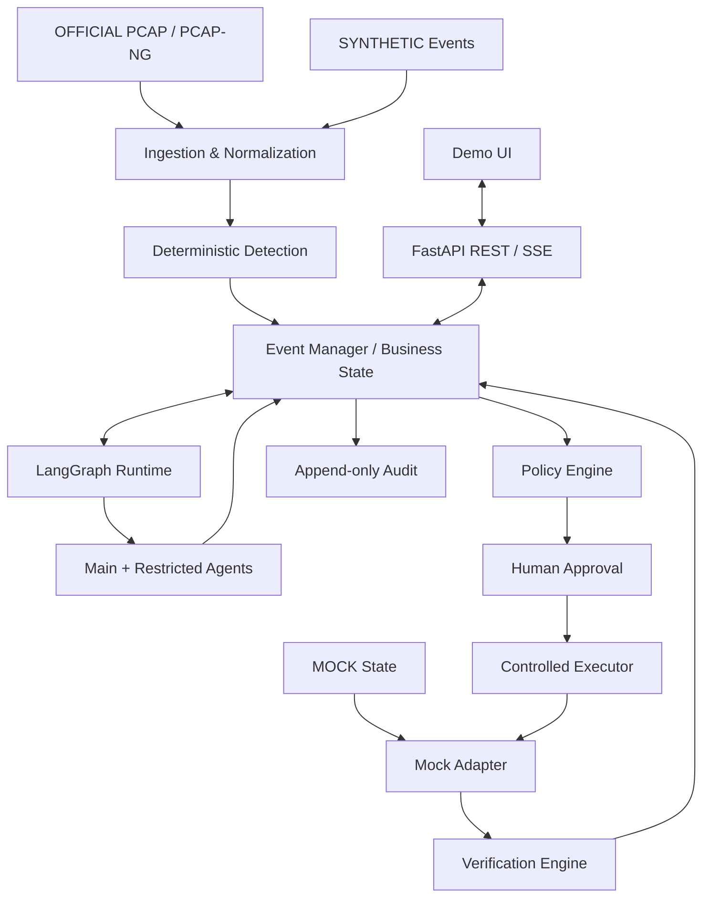
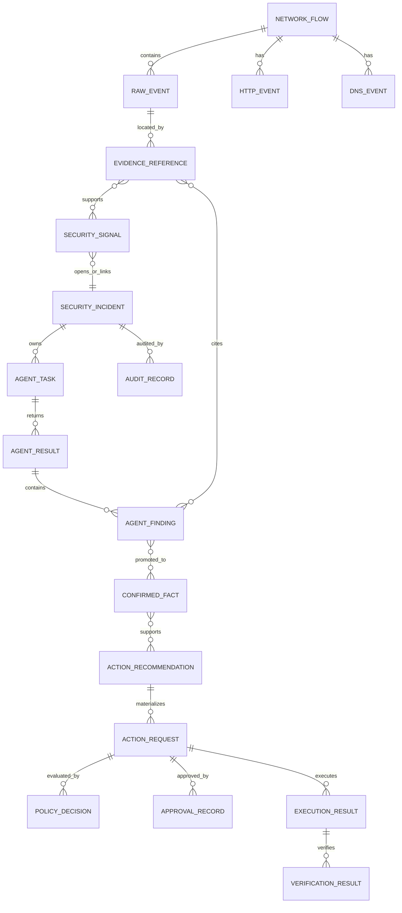
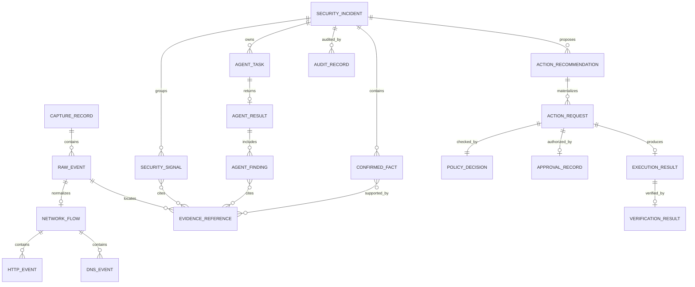
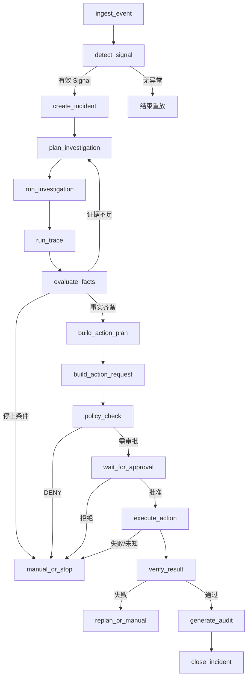
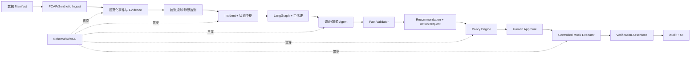

# 御盾智核开发详细设计 V1.0

> 文档性质：正式编码前的技术规格基线  
> 上游依据：`1-设计文档.md`、`2-开发-总体方案.md`、`3-官方数据集理解与三方对齐报告.md`  
> 适用范围：第一阶段 Golden Path；本文不代表系统已经编码或部署  
> 变更规则：核心 Schema、状态守卫、Agent 权限和高风险处置链变更必须同步更新本文、迁移脚本与验收用例

---

## Step 1：《详细设计前一致性审查》

### 1.1 审查结论

三份上游文档不存在阻止详细设计的未解决 P0 冲突，**可以进入详细设计**。

原有数据缺口已经形成确定处理方式：官方 PCAP 仅承担网络证据；CI、凭据和云资源事件由明确标识的 Synthetic 数据补齐；冻结、轮换和恢复状态由 Mock/沙箱承担。该分层不是临时解释，而是本详细设计的强制数据契约。

### 1.2 仍需外部确认但不阻塞编码的事项

- 【需要比赛方/企业方确认】官方 PCAP 是否为最终强制测评输入，以及是否还有深信服平台告警、端点和日志数据。
- 【需要比赛方/企业方确认】平台工具/API、部署环境、出入网限制和擂台赛接口。
- 【需要比赛方/企业方确认】比赛“零人工干预”评分与生产高风险人工审批边界如何解释。
- 【待验证】目标开发机与比赛设备的 CPU、内存、GPU 和操作系统；开发阶段应通过环境探测和基准测试取得，不要求非技术负责人主观选择。这些只影响模型部署和超时配置，不改变领域契约与安全守卫。

### 1.3 本轮冻结的关键技术决策

| 决策 | 冻结结论 | 理由 |
|---|---|---|
| 系统形态 | Python 模块化单体 + 独立前端，不拆微服务 | 第一版需要稳定闭环，模块边界比分布式复杂度更重要 |
| 后端 | Python 3.11、FastAPI、Pydantic v2、SQLAlchemy 2、Alembic | 与 LangGraph 和模型生态匹配，Schema 与 API 契约统一 |
| 业务数据库 | SQLite WAL 首版；保留 PostgreSQL 迁移能力 | 单机 Demo 并发低，SQLite 足够；不提前引入运维成本 |
| LangGraph Checkpoint | 独立 SQLite checkpoint 库 | 流程运行状态与安全业务事实物理/逻辑分离 |
| PCAP 解析 | `dpkt` 的 PCAP/PCAP-NG Reader + 最小 TCP 流聚合 | 依赖轻、适合离线样本；首版不追求全协议 DPI |
| TLS | 不解密，只记录连接元数据 | 官方数据没有可用会话密钥，不能虚构内容 |
| 数据库协议 | 首版仅识别端口/协议和保存载荷引用，不深度解析 TDS/MySQL/Oracle | Golden Path 不依赖数据库协议语义 |
| 检测 | 确定性规则为主，SecureBERT 可选增强 | Demo 不能因未验证模型失败而不可复现 |
| RAG/BGE | 首版非必需，先用 SQL/时间排序检索；保留适配接口 | Golden Path 证据量小，复杂 RAG 没有必要 |
| MCP | 第一阶段不使用 | 内部函数和受控 Adapter 更容易限制权限、测试和审计 |
| 前端 | React + Vite + TypeScript；FastAPI 提供 REST + SSE | 四面板交互和实时状态展示明确，仍可由单一部署包提供 |
| 认证 | 本地 Demo 用户与角色会话，不宣称企业 IAM 集成 | 需要真实审批身份分离，但不伪造外部平台能力 |
| ID | 运行时对象使用带前缀 ULID；源派生对象使用带前缀 SHA-256 截断摘要 | 运行时全局唯一且可排序，官方证据重复解析可复现 |
| 审计 | SQLite append-only 记录 + 版本历史 + SHA-256 哈希链 | 足以证明无静默覆盖，不引入区块链 |

---

## Step 2：《开发详细设计》

以下第 2～18 章为正式编码所依据的完整详细设计；第 19～22 章进一步给出关系图、依赖、优先级和编码任务。

## 2. 总体实现架构

### 2.1 模块化单体边界



可编辑版本：`docs/diagrams/4-GoldenPath模块依赖.drawio`。

### 2.2 业务状态与运行状态分离

| 类型 | 保存内容 | 权威性 | 存储 |
|---|---|---|---|
| Business Event State | Incident、Signal、Evidence、Fact、Task、Result、Action、Approval、Execution、Verification、Audit | 安全事实唯一来源 | `business.db` |
| LangGraph Runtime State | graph_run_id、incident_id、current_node、活动 task 引用、pending interrupt、最后错误 | 只说明流程运行到哪里 | `checkpoints.db` Checkpoint |

LangGraph Checkpoint 绝不能代替业务数据库。图状态只保存 ID 和轻量路由字段，不保存完整 PCAP、明文载荷、完整 Evidence 或凭据数据。LangGraph 官方文档确认持久化 Checkpoint 是人工中断和恢复的基础，SQLite checkpointer 适合本地工作流；审批节点采用 `interrupt()`，恢复时使用相同 `thread_id` 和 `Command(resume=...)`。参考：[Interrupts](https://docs.langchain.com/oss/python/langgraph/interrupts)、[Persistence](https://docs.langchain.com/oss/python/langgraph/persistence)。

### 2.3 四类来源的统一解释

```text
OFFICIAL  比赛方 PCAP 及其确定性解析结果
SYNTHETIC 团队构造的 CI / 云业务事件及演示关联
MOCK      有状态演示服务产生的状态、执行和回读
SYSTEM    系统产生的 Signal、Fact、Task、Result、Decision、Audit 等派生记录
```

每个派生对象必须通过 `evidence_refs` 或对象引用回到原始来源。`source_type=SYSTEM` 不会掩盖底层来源，因为 EvidenceReference 同时保存 OFFICIAL/SYNTHETIC/MOCK 定位。

---

## 3. Domain Model

### 3.1 核心对象责任表

| 对象 | 对象作用 | 谁创建 | 谁读取 | 谁可以修改 | 进入审计 | 生命周期/关系 |
|---|---|---|---|---|---|---|
| RawEvent | 保存规范化后的最小原始事件 | Ingestion Adapter | Monitor、Investigator、Trace（按权限） | 创建后不可改；纠错生成新版本 | 是 | 来源于 PCAP/Synthetic/Mock；被 EvidenceReference 定位 |
| NetworkFlow | 聚合同一 PCAP 内双向网络流 | PCAP Normalizer | Monitor、Investigator、Trace | 创建后不可改；解析器升级生成新版本 | 是 | 包含多个 RawEvent；不能跨 PCAP |
| HTTPEvent | 表示一组可见 HTTP 请求/响应字段 | HTTP Parser | Monitor、Investigator | 创建后不可改 | 是 | 属于一个 NetworkFlow；正文只存引用 |
| DNSEvent | 表示 DNS 查询与可见响应 | DNS Parser | Monitor、Trace | 创建后不可改 | 是 | 属于一个 NetworkFlow |
| SecuritySignal | 表示检测器发现的风险线索 | Rule Detector / Monitor | 全部 Agent（摘要视图） | 只能追加更正记录 | 是 | 引用 Evidence；可触发 Incident |
| EvidenceReference | 提供可回查、不可歧义的证据定位 | Evidence Service | 按可见性读取 | append-only；纠错用 supersedes | 是 | 可被 Signal、Fact、Finding、Action 等引用 |
| ConfirmedFact | 保存经规则验证的事件事实 | Event Manager | 全部 Agent（授权视图） | 只能更正/撤回，保留历史 | 是 | 由 Finding/Signal + Evidence 促成 |
| AgentTask | 主代理给受限子代理的任务契约 | Main Agent 通过 Task Service | 目标 Agent、Main、Audit | 创建后只允许确定性状态更新 | 是 | 产生一个或多个 AgentResult |
| AgentResult | 一次 AgentTask 的结构化结果 | 目标 Agent | Main、Event Manager、Audit | append-only | 是 | 包含 AgentFinding，不等于事件结论 |
| AgentFinding | Agent 对证据的分析主张 | 目标 Agent | Main、Event Manager、Audit | append-only；可被新 Finding 反驳 | 是 | 可发起 FactPromotionRequest |
| SecurityIncident | 事件聚合根和当前业务状态摘要 | Event Manager | API、UI、全部 Agent（裁剪视图） | 只有 Event Manager 写；Human 通过请求强制修改 | 是 | 只保存对象 ID/摘要，不无限嵌套 |
| ActionRecommendation | 调查后提出的处置方向 | Main Agent | Operator、Policy、Human | append-only | 是 | 由 Fact 支持，转换为 ActionRequest |
| ActionRequest | 可校验的动作申请 | Operation Agent 通过 Action Service | Policy、Human、Executor、Audit | 状态由确定性服务更新 | 是 | 一个申请包含受控操作步骤 |
| PolicyDecision | 确定性策略判断 | Policy Engine | Human、Executor、Audit | 不可由 LLM 修改 | 是 | 一对一关联 ActionRequest 的当前评估版本 |
| ApprovalRecord | 人工批准/拒绝记录 | Approval API | Executor、Main、Audit | append-only；新决定生成新记录 | 是 | 必须绑定 action_request_id 和策略版本 |
| ExecutionResult | 受控执行步骤及前后状态 | Controlled Executor | Main、Verifier、Audit | append-only | 是 | 引用 Mock 快照与 idempotency_key |
| VerificationResult | 恢复断言的实际结果 | Verification Engine | Main、Event Manager、Audit、UI | append-only | 是 | 决定是否允许 VERIFIED |
| AuditRecord | 记录读取、写入、调度、审批和状态变化 | Audit Service | Audit Agent、授权人员 | 永不更新/删除 | 自身 | 按 incident_id 构成哈希链 |
| AssociationRecord | 明确说明两个来源为何在 Demo 中关联 | Scenario Loader / Human | Main、Investigator、Trace、Audit | append-only | 是 | 必须为 SYNTHETIC，不能制造 OFFICIAL 字段 |

### 3.2 核心关系图



可编辑版本：`docs/diagrams/4-核心Schema总览.drawio`。

### 3.3 统一枚举

| 枚举 | 值 |
|---|---|
| SourceType | `OFFICIAL`, `SYNTHETIC`, `MOCK`, `SYSTEM` |
| IncidentStatus | `NEW`, `DETECTED`, `INVESTIGATING`, `ATTRIBUTED`, `CONTAINED`, `ROTATED`, `VERIFIED`, `CLOSED` |
| AutomationState | `ACTIVE`, `AWAITING_APPROVAL`, `MANUAL_REQUIRED`, `PAUSED`, `FAILED_SAFE`, `COMPLETED` |
| Severity | `INFO`, `LOW`, `MEDIUM`, `HIGH`, `CRITICAL` |
| TaskStatus | `PENDING`, `RUNNING`, `COMPLETED`, `PARTIAL`, `FAILED`, `DENIED`, `MANUAL_REQUIRED` |
| ConfidenceLevel | `LOW`, `MEDIUM`, `HIGH`；仅描述分析把握，绝不是授权阈值 |
| SupportType | `SUPPORTS`, `CONTRADICTS`, `INCONCLUSIVE`；描述证据/主张之间支持、反驳或无法判断的关系 |
| FactSupportType | `DIRECT`, `CORROBORATED`, `INFERRED`；仅用于说明 ConfirmedFact 的证据形成方式 |
| EvidenceSensitivity | `PUBLIC`, `INTERNAL`, `SENSITIVE`, `RESTRICTED`, `SECRET`；`SECRET` 默认拒绝所有普通 Agent |
| ApprovalDecision | `APPROVED`, `REJECTED` |
| PolicyOutcome | `ALLOW_WITH_APPROVAL`, `DENY`；首版无无需审批高风险分支 |
| ExecutionStatus | `PENDING`, `RUNNING`, `SUCCEEDED`, `PARTIAL`, `FAILED`, `DENIED`, `UNKNOWN`；无法确认副作用结果时必须使用 `UNKNOWN`，不得假定成功 |
| VerificationAssertionType | `OLD_KEY_DISABLED`, `OLD_KEY_CALL_REJECTED`, `MALICIOUS_ACTIVITY_STOPPED`, `NEW_KEY_ACTIVE`, `LEGITIMATE_CI_RECOVERED`, `HIGH_COST_RESOURCE_STOPPED` |

#### 3.3.1 Enum Compatibility Decision（2026-08-10 冻结）

第 3.3 节是唯一规范枚举来源。后续 Schema、ORM、fixture 和状态守卫必须引用这里的值，禁止再使用语义重复的 `RUNNING/WAITING_APPROVAL/COMPLETE`（AutomationState）、`SUCCEEDED/BLOCKED/CANCELLED`（TaskStatus）或旧版 Verification 名称。`SECRET` 是 Evidence ACL 的安全必需级别，`UNKNOWN` 是有副作用执行无法确认结果时的 fail-safe 状态，因此作为统一枚举的正式补充值保留。`SupportType` 表达主张关系，`FactSupportType` 表达事实证据形成方式，二者语义不同，不能互作别名。

当前数据库尚无使用冲突旧值的业务记录，初始 migration 的相关列均为字符串且不含数据库枚举约束，因此本次冻结不需要数据迁移。未来导入历史 JSON 时只接受本节规范值；如出现旧值，必须通过显式、版本化迁移转换，禁止运行时静默改名。

### 3.4 统一 ID 体系

#### 3.4.1 生成规则

- 运行时业务对象：`<prefix>_<ULID>`，全局唯一、按创建时间可排序，不要求可复现。
- 官方源派生对象：`<prefix>_<sha256(canonical_source_locator + parser_version)[:24]>`，同一文件、定位和解析器版本下可复现。
- 所有 ID 使用小写前缀，主体保持 ULID 大写或摘要小写；数据库按字符串保存。

| ID | 前缀 | 生成者 | 唯一/可复现 | 前端可见性 |
|---|---|---|---|---|
| incident_id | `inc_` | Event Manager | 全局唯一；不可复现 | 显示 |
| signal_id | `sig_` | Detection Service | 全局唯一；同次检测唯一 | 显示 |
| evidence_id | `evd_` | Evidence Service | 官方定位可复现；其他全局唯一 | 显示 |
| task_id | `tsk_` | Task Service | 全局唯一 | 显示 |
| result_id | `res_` | Agent Runtime | 全局唯一 | 显示 |
| finding_id | `fnd_` | Agent Runtime | 全局唯一 | 显示 |
| fact_id | `fac_` | Event Manager | 全局唯一 | 显示 |
| recommendation_id | `rec_` | Main Agent Service | 全局唯一 | 显示 |
| action_request_id | `arq_` | Action Service | 全局唯一 | 显示 |
| policy_decision_id | `pol_` | Policy Engine | 全局唯一 | 显示 |
| approval_id | `apr_` | Approval Service | 全局唯一 | 显示 |
| execution_id | `exe_` | Controlled Executor | 全局唯一 | 显示 |
| verification_id | `ver_` | Verification Engine | 全局唯一 | 显示 |
| audit_id | `aud_` | Audit Service | 全局唯一 | 详情页显示 |
| capture_id | `cap_` | PCAP Ingestor | 文件 SHA-256 派生，可复现 | 经 Evidence 显示 |
| flow_id | `flw_` | Flow Aggregator | 同 capture/五元组/首次包/序号可复现 | 经 Evidence 显示 |
| raw_event_id | `raw_` | Normalizer | 同源定位/解析器版本可复现 | 仅证据详情 |
| graph_run_id | `run_` | Orchestration Service | 全局唯一 | 内部；诊断页可见 |
| state_snapshot_id | `snp_` | Mock State Service | 全局唯一 | 验证详情显示 |
| association_id | `asc_` | Scenario Loader | 全局唯一 | 证据详情显示 |
| assessment_id | `rsk_` | Assessment Service | 全局唯一 | 事件风险摘要显示 |

#### 3.4.2 关联约束

- `flow_id` 只能在一个 `capture_id` 内有效，禁止作为跨 PCAP 的事件关联键。
- `incident_id` 只能由 Event Manager 创建，任何原始 Official 数据都不能预置它。
- Synthetic 场景可携带 `scenario_id`、`tenant_id`、`credential_id` 等演示关联键；这些键不反向写入 Official RawEvent。
- API 返回 ID，不返回本地绝对文件路径；`source_location` 对前端只暴露安全别名和定位片段。
- HTTPEvent 与 DNSEvent 都是 RawEvent 的协议化视图，继续使用可复现 `raw_` ID，并由 event/model 类型区分，不增加形式化专用前缀；RiskAssessment 是独立事件级引用对象，固定使用 `rsk_`。

---

## 4. 核心 Schema 规范

### 4.1 通用字段与序列化规则

所有 Schema 使用 Pydantic v2 风格，API 采用 JSON；时间统一为 UTC RFC 3339（带 `Z`），禁止无时区时间。

来源相关核心对象必须在顶层包含：

```yaml
schema_version: "1.0"
source_type: OFFICIAL | SYNTHETIC | MOCK | SYSTEM
source_id: string
source_location: object | null
source_timestamp: datetime | null
created_at: datetime
metadata: object
```

约束：

- `metadata` 只保存非核心扩展字段，序列化后上限 16 KiB，不允许放明文凭据、完整 payload 或改变业务语义的隐藏字段。
- 核心 ID、状态、证据引用不得只放在 `metadata`。
- JSON 输出使用确定性 key 排序生成内容哈希；哈希前排除 `record_hash` 本身。
- IP 字段使用 Pydantic IPvAnyAddress；端口为 0—65535；计数非负。
- 任何可能包含 Authorization、Cookie、Token、Secret 的字段在写数据库前必须经过 Redaction Service。

### 4.2 CaptureRecord

```yaml
capture_id: string                  # cap_<sha256前24位>
source_type: OFFICIAL
source_id: string                   # 官方文件安全别名
source_location:
  dataset: "official_nta"
  relative_path: string             # 必须通过 allowlist，禁止 .. 和绝对路径
file_sha256: string
format: PCAP | PCAP_NG
file_size: integer
packet_count: integer | null
first_packet_at: datetime | null
last_packet_at: datetime | null
parser_version: string
parse_status: PENDING | PARSED | PARTIAL | FAILED
parse_error: string | null
created_at: datetime
```

CaptureRecord 是官方文件登记，不等于攻击标签。文件名只能保存为 `source_id`/展示名，不能自动写入 `human_label`。

### 4.3 RawEvent

```yaml
event_id: string                    # raw_<可复现摘要>
capture_id: string | null
source_type: OFFICIAL | SYNTHETIC | MOCK
source_id: string
source_location: object
source_timestamp: datetime
ingested_at: datetime
event_kind: PACKET | NETWORK | HTTP | DNS | CI | SECRET_ACCESS | CREDENTIAL_EXPOSURE | CLOUD_API | RESOURCE_ACCESS | RESOURCE_OPERATION | MOCK_STATE
src_ip: ip | null
dst_ip: ip | null
src_port: integer | null
dst_port: integer | null
transport_protocol: TCP | UDP | ICMP | OTHER | null
application_protocol: HTTP | DNS | TLS | TDS | MYSQL | ORACLE | UNKNOWN | null
payload_reference: object | null    # 只保存定位，不复制完整 payload
payload_sha256: string | null
parser_version: string
parse_status: PARSED | PARTIAL | OPAQUE | FAILED
redaction_status: NOT_REQUIRED | REDACTED | RESTRICTED
attributes: object                  # 按 event_kind 校验的有限字段
created_at: datetime
```

RawEvent 创建后不可原地更新。解析器升级或纠错生成新的 event_id，并通过 `supersedes_event_id`（放在受控扩展字段中）指向旧版本。

### 4.4 NetworkFlow

```yaml
flow_id: string
capture_id: string
source_type: OFFICIAL
source_id: string
source_location: {capture_id, first_packet_index, last_packet_index}
five_tuple:
  initiator_ip: ip
  initiator_port: integer
  responder_ip: ip
  responder_port: integer
  protocol: TCP | UDP
start_time: datetime
end_time: datetime
packet_count: integer
byte_count: integer
direction: INITIATOR_TO_RESPONDER | RESPONDER_TO_INITIATOR | BIDIRECTIONAL
application_protocol: HTTP | DNS | TLS | TDS | MYSQL | ORACLE | UNKNOWN
raw_event_ids: [string]
tcp_summary: object | null
parser_version: string
created_at: datetime
```

`flow_id = flw_ + sha256(capture_id | canonical_bidirectional_five_tuple | first_packet_timestamp_ns | stream_ordinal | parser_version)[:24]`。`stream_ordinal` 用于同一五元组在同一抓包内被重新使用的情况。

### 4.5 HTTPEvent

```yaml
http_event_id: string
flow_id: string
capture_id: string
source_type: OFFICIAL
source_timestamp: datetime
request_packet_range: [integer, integer]
response_packet_range: [integer, integer] | null
method: GET | POST | PUT | PATCH | DELETE | HEAD | OPTIONS | OTHER
scheme: http | unknown
host: string | null
uri_path: string
query_keys: [string]
sanitized_query: string | null
headers_redacted: object            # 只保留 allowlist；敏感值为 [REDACTED]
body_reference: object | null
body_sha256: string | null
status_code: integer | null
response_headers_redacted: object
response_reference: object | null
parse_status: COMPLETE | REQUEST_ONLY | PARTIAL | OPAQUE
parser_version: string
created_at: datetime
```

Header allowlist 首版仅保留 `Host`、`User-Agent`、`Content-Type`、`Accept`、`Server` 等非凭据字段。`Authorization`、`Cookie`、`Set-Cookie`、名称含 `token/key/secret/credential` 的 Header 永不进入普通事件字段，只记录“存在敏感 Header”的布尔标志和哈希。

### 4.6 DNSEvent

```yaml
dns_event_id: string
flow_id: string
capture_id: string
source_type: OFFICIAL
source_timestamp: datetime
src_ip: ip
src_port: integer
dns_server: ip
query_id: integer
query_name: string
query_type: A | AAAA | CNAME | TXT | MX | NS | PTR | OTHER
response_codes: [string]
answers_redacted: [string]
packet_indexes: [integer]
parse_status: QUERY_ONLY | COMPLETE | PARTIAL
parser_version: string
created_at: datetime
```

DNS 解析只表达网络事实。命中 DNSLog 规则前必须有显式规则配置，不能因为域名很长就自动认定恶意。

### 4.7 EvidenceReference

EvidenceReference 是“如何回到原始事实”的稳定指针，而不是复制一段模型总结。证据创建后不可原地修改；解析纠错必须新建证据并通过 `supersedes_evidence_id` 指向旧记录。

```yaml
evidence_id: string
incident_id: string | null
source_type: OFFICIAL | SYNTHETIC | MOCK | SYSTEM
source_dataset: string
source_record_id: string
evidence_type: PCAP_PACKET | NETWORK_FLOW | HTTP_EVENT | DNS_EVENT |
               SYNTHETIC_EVENT | MOCK_STATE | EXECUTION_RECEIPT | AUDIT_RECORD
locator:                         # 按 evidence_type 校验的联合类型
  capture_id: string | null
  packet_indexes: [integer] | null
  flow_id: string | null
  synthetic_event_id: string | null
  state_snapshot_id: string | null
  operation_id: string | null
  audit_id: string | null
  field_path: string | null
content_sha256: string
summary: string
redacted_snapshot: object | null
  sensitivity: PUBLIC | INTERNAL | SENSITIVE | RESTRICTED | SECRET
allowed_agent_types: [string]
created_by: string
created_at: datetime
supersedes_evidence_id: string | null
correction_reason: string | null
```

约束如下：

- OFFICIAL 证据必须指向 `capture_id + packet_indexes/flow_id`，不能只写文件名；
- SYNTHETIC 证据必须指向带明确 `scenario_id` 的合成事件；
- MOCK 证据必须指向不可变状态快照或操作回执；
- 模型生成的文字不得作为 locator，也不得拥有 OFFICIAL 来源类型；
- `redacted_snapshot` 只为界面快速展示，原始真值仍以 locator 回查结果为准；
- SECRET 证据默认不进入模型上下文。首版系统不保存、更不展示明文 API Key。

### 4.8 SecuritySignal

```yaml
signal_id: string
incident_id: string | null
signal_type: NTA_SQLI | NTA_CMDI | NTA_WEBSHELL | NTA_DNSLOG |
             CI_ACTION_MUTATION | SECRET_READ | CREDENTIAL_EXPOSURE |
             ABNORMAL_CLOUD_API | SENSITIVE_DATA_ACCESS | HIGH_COST_CREATION
severity: INFO | LOW | MEDIUM | HIGH | CRITICAL
subject_refs: [string]
trigger_reason: string
detector:
  detector_type: RULE | MODEL
  detector_id: string
  detector_version: string
evidence_refs: [string]
source_types: [OFFICIAL | SYNTHETIC | MOCK | SYSTEM]
status: OPEN | ACKNOWLEDGED | DISMISSED | PROMOTED
created_at: datetime
```

Signal 只是“值得调查的异常”，不等于攻击已经成立。规则或模型可以创建 Signal，但每个 Signal 至少引用一条可回查证据。模型只负责分类、归纳或排序，不能凭自身输出制造证据。

### 4.9 ConfirmedFact、AgentFinding 与 RiskAssessment

```yaml
ConfirmedFact:
  fact_id: string
  incident_id: string
  fact_type: string
  subject_refs: [string]
  statement: string
  evidence_refs: [string]
  support_type: DIRECT | CORROBORATED | INFERRED  # FactSupportType
  confidence_level: LOW | MEDIUM | HIGH
  confidence_basis: string
  proposed_by: string
  validated_by: EVENT_STATE_MANAGER
  created_at: datetime

AgentFinding:
  finding_id: string
  incident_id: string
  task_id: string
  finding_type: string
  statement: string
  evidence_refs: [string]
  confidence_level: LOW | MEDIUM | HIGH
  limitations: [string]
  created_at: datetime

RiskAssessment:
  assessment_id: string
  incident_id: string
  severity: LOW | MEDIUM | HIGH | CRITICAL
  affected_subjects: [string]
  impact_summary: string
  fact_refs: [string]
  unresolved_risks: [string]
  assessed_by: string
  created_at: datetime
```

三者边界必须保持稳定：ConfirmedFact 是经确定性校验、能够回指证据的事实；AgentFinding 是某个任务的分析结果；RiskAssessment 是在事实基础上形成的风险判断。Finding 不会因为“置信度高”自动升级为 Fact。

Golden Path 首版事实提升规则如下，均由事件状态管理器验证字段一致性，不采用未经验证的数值阈值：

| Fact 类型 | 最低事实条件 | 必需证据 |
|---|---|---|
| `CI_ACTION_MUTATED` | Action 实际摘要与基线摘要不一致 | CI 安全合成事件、基线引用 |
| `SECRET_ACCESSED` | 同一 Runner 读取目标凭据引用 | SecretAccess 合成事件 |
| `CREDENTIAL_EXPOSED` | 暴露事件与上述读取事件可由 scenario/runner/credential_ref 关联且结果成功 | CredentialExposure 合成事件 |
| `CREDENTIAL_ABUSED` | 云 API 事件使用同一 credential_ref，来源不在期望范围且调用成功 | Cloud API 合成事件；可附官方网络证据但不强求虚假关联 |
| `SENSITIVE_DATA_ACCESSED` | 资源敏感级别为 sensitive/restricted 且读取成功 | ResourceAccess 合成事件 |
| `HIGH_COST_RESOURCE_CREATED` | 操作为 CREATE、成本等级为 HIGH 且执行成功 | ResourceOperation 合成事件 |

【待设计】生产化的置信度计算、关联阈值与时间窗口。首版只使用 LOW/MEDIUM/HIGH 加文字依据，避免伪精确的小数分值。

### 4.10 AgentTask

```yaml
task_id: string
incident_id: string
task_type: MONITOR | INVESTIGATE | TRACE | OPERATE | AUDIT
task_goal: string
allowed_context:
  fact_refs: [string]
  signal_refs: [string]
  field_allowlist: [string]
evidence_refs: [string]
allowed_tools: [string]
expected_output: string
assigned_agent_type: string
status: PENDING | RUNNING | COMPLETED | PARTIAL | FAILED | DENIED | MANUAL_REQUIRED
attempt: integer
created_by: MAIN_AGENT | SYSTEM
created_at: datetime
started_at: datetime | null
completed_at: datetime | null
```

创建任务时由工具注册表校验 `assigned_agent_type` 与 `allowed_tools`，不能由主代理临时扩大。`allowed_context` 是数据最小化边界；Agent 查询证据时还要再次接受证据 ACL 校验。

### 4.11 AgentResult

```yaml
result_id: string
task_id: string
incident_id: string
task_status: PENDING | RUNNING | COMPLETED | PARTIAL | FAILED | DENIED | MANUAL_REQUIRED
findings: [string]                 # finding_id
evidence_refs: [string]
confidence_level: LOW | MEDIUM | HIGH
confidence_basis: string
unresolved_questions: [string]
next_step: string | null
approval_required: boolean
model_trace_ref: string | null
errors: [object]
created_at: datetime
```

AgentResult 只是一次受限任务的交付物，不是安全事件的最终裁决。结构化 Schema 校验失败时，不写入正式 Result；允许一次修复性重试，仍失败则任务标记 FAILED，并转人工检查。

### 4.12 SecurityIncident

```yaml
incident_id: string
title: string
incident_type: API_CREDENTIAL_COMPROMISE
tenant_ref: string
status: NEW | DETECTED | INVESTIGATING | ATTRIBUTED | CONTAINED |
        ROTATED | VERIFIED | CLOSED
automation_state: ACTIVE | AWAITING_APPROVAL | MANUAL_REQUIRED | PAUSED | FAILED_SAFE | COMPLETED
severity: LOW | MEDIUM | HIGH | CRITICAL
signal_refs: [string]
fact_refs: [string]
latest_assessment_ref: string | null
task_refs: [string]
pending_action_refs: [string]
parent_incident_id: string | null
summary: string
opened_at: datetime
updated_at: datetime
closed_at: datetime | null
version: integer
```

Incident 只保存索引和稳定摘要，不嵌入大段证据或聊天记录。`version` 用于乐观锁，防止审批回调和异步任务同时覆盖状态。事件关闭后发现新的攻击活动，应创建带 `parent_incident_id` 的新事件，不能静默篡改已关闭记录。

### 4.13 ActionRecommendation、ActionRequest 与 PolicyDecision

```yaml
ActionRecommendation:
  recommendation_id: string
  incident_id: string
  recommendation_type: CONTAIN_AND_ROTATE_CREDENTIAL
  rationale: string
  fact_refs: [string]
  expected_effect: string
  business_risks: [string]
  proposed_by: MAIN_AGENT
  created_at: datetime

ActionRequest:
  action_request_id: string
  incident_id: string
  recommendation_id: string
  action_type: CREDENTIAL_CONTAINMENT_PLAN
  target_ref: string
  operations:
    - operation_type: FREEZE_OLD_KEY | CREATE_NEW_KEY_VERSION | UPDATE_CI_BINDING
      operation_id: string
      parameters: object
  reason: string
  fact_refs: [string]
  requested_by: OPERATION_AGENT
  risk_level: HIGH
  idempotency_key: string
  status: DRAFT | POLICY_PENDING | POLICY_DENIED | APPROVAL_PENDING |
          APPROVED | REJECTED | EXECUTING | EXECUTED | FAILED
  created_at: datetime

PolicyDecision:
  policy_decision_id: string
  action_request_id: string
  decision: ALLOW_WITH_APPROVAL | DENY
  policy_version: string
  checks: [{check_id: string, passed: boolean, reason: string}]
  approval_requirement: HUMAN_REQUIRED | NOT_ALLOWED
  decided_by: POLICY_ENGINE
  created_at: datetime
```

Golden Path 使用一个“凭据遏制与轮换计划”承载三项有序操作，一次审批授权该计划，执行器仍对每一步单独校验、落审计并可幂等回查。首版不设计任意脚本执行能力。

策略引擎至少检查：动作是否在白名单、目标是否属于当前事件租户、事实是否齐备、操作顺序是否合法、请求者是否为操作执行子代理、参数是否包含明文凭据、是否需要人工审批。任一检查失败均不得进入执行节点。

### 4.14 ApprovalRecord、ExecutionResult 与 VerificationResult

```yaml
ApprovalRecord:
  approval_id: string
  action_request_id: string
  decision: APPROVED | REJECTED
  approver_id: string
  approver_role: APPROVER
  comment: string
  request_digest: string
  decided_at: datetime

ExecutionResult:
  execution_id: string
  action_request_id: string
  operation_results:
    - operation_id: string
      status: PENDING | RUNNING | SUCCEEDED | PARTIAL | FAILED | DENIED | UNKNOWN
      state_snapshot_before: string
      state_snapshot_after: string | null
      receipt_ref: string
      error_code: string | null
  overall_status: SUCCEEDED | PARTIAL | FAILED | UNKNOWN
  executor: SYSTEM_EXECUTOR
  idempotency_key: string
  started_at: datetime
  completed_at: datetime

VerificationResult:
  verification_id: string
  incident_id: string
  execution_id: string
  assertions:
    - assertion_type: OLD_KEY_DISABLED | OLD_KEY_CALL_REJECTED |
                      MALICIOUS_ACTIVITY_STOPPED | NEW_KEY_ACTIVE |
                      LEGITIMATE_CI_RECOVERED | HIGH_COST_RESOURCE_STOPPED
      passed: boolean
      observed_value: object
      evidence_refs: [string]
      checked_at: datetime
  overall_status: PASSED | FAILED | INCONCLUSIVE
  failed_assertions: [string]
  next_step: CLOSE | REPLAN | MANUAL_REVIEW
  created_at: datetime
```

ApprovalRecord 保存请求摘要，确保审批之后请求内容不能被替换。执行接口返回成功只生成 ExecutionResult；只有六项恢复断言全部通过，事件才允许进入 VERIFIED。

### 4.15 AuditRecord 与 AssociationRecord

```yaml
AuditRecord:
  audit_id: string
  incident_id: string | null
  sequence_no: integer
  actor_type: HUMAN | AGENT | SYSTEM
  actor_id: string
  event_type: string
  object_type: string
  object_id: string
  summary: string
  payload_redacted: object
  occurred_at: datetime
  prev_hash: string | null
  record_hash: string

AssociationRecord:
  association_id: string
  incident_id: string
  left_object_ref: string
  right_object_ref: string
  association_type: SAME_CREDENTIAL | SAME_RUNNER | SAME_SOURCE |
                    SAME_RESOURCE | TEMPORAL_SEQUENCE | DEMO_SCENARIO
  association_basis: EXACT_FIELD | RULE | HUMAN_CONFIRMED | DEMO_SCENARIO
  evidence_refs: [string]
  created_by: string
  created_at: datetime
```

审计采用应用层追加写和哈希链：`record_hash = SHA-256(canonical_json(除 record_hash 外的当前记录))`。这是防止演示期间记录被无声改写的完整性机制，不宣称为区块链或生产级不可抵赖系统。

官方 PCAP 与合成 CI/云事件没有真实共同业务 ID。若 Demo 需要把二者放在同一事件视图，只能用 `association_basis=DEMO_SCENARIO` 明示“场景编排关联”，不得写成数据天然证明的因果关系。

## Step 3：《核心 Schema 总览》



可编辑关系图另存为 [4-核心Schema总览.drawio](./diagrams/4-核心Schema总览.drawio)。开发时以本章 Schema 和约束为准，图只用于快速理解。

## 6. 官方 PCAP 接入与网络证据设计

### 6.1 数据处理边界

官方目录包含 2337 个 PCAP/PCAPNG 文件，约 257 MB。首版不批量解析全部文件，也不把文件名当作可靠标签；先用人工核验样本集完成解析、规则和证据引用闭环。

处理流水线为：

```text
只读文件清单 → 格式与哈希校验 → 报文解析 → 流聚合 → 协议事件抽取
→ 规则检测 → Signal → EvidenceReference → 人工核验
```

实现规则：

1. 仅允许读取预配置 manifest 中的相对路径，API 不接受任意本机路径；
2. 通过 magic number 识别 PCAP/PCAPNG，不仅依赖扩展名；
3. 计算文件 SHA-256，生成稳定 `capture_id`，原文件保持只读；
4. 首版解析 Ethernet、IPv4、TCP、UDP、HTTP/1.x 与 DNS；无法识别的内容保留 OPAQUE 状态；
5. packet index 从 1 开始，在单个 capture 内稳定；
6. flow_id 由 capture_id、五元组、方向规范化和首包序号确定，只保证单文件内稳定，不虚构跨文件会话；
7. TCP 只做满足样本集所需的最小重组；乱序、分片、截断等情况标 PARTIAL；
8. TLS 加密流量只记录元数据，不解密；数据库私有协议首版不做深度解析；
9. HTTP Header 和 Body 在落库前执行凭据脱敏与大小限制；
10. 解析失败进入隔离清单，不得用空字段继续生成高危 Signal。

首版使用 `dpkt` 的原因是它能轻量解析 PCAP/PCAPNG 和常见协议，适合离线 Demo；如果验证样本显示其重组能力不足，再引入更重的解析器。【待验证】

### 6.2 首版确定性检测规则

| Rule ID | 输入 | 核心条件 | 输出 | 误报控制 |
|---|---|---|---|---|
| `NTA-SQLI-001` | HTTP URI/query/body | URL 解码最多两次后出现 SQL 结构组合，如 `union select`、`extractvalue/updatexml`、`sleep/benchmark` 或带上下文的恒真表达式 | `NTA_SQLI` Signal + HTTP/packet 证据 | 单个 SQL 关键词不触发；保留原始与规范化值；人工核验样本 |
| `NTA-CMDI-001` | HTTP URI/query/body | 命令分隔符与系统命令关键词组合，或明确 OGNL/SpEL Runtime exec 结构 | `NTA_CMDI` Signal | 需要结构组合，不以普通分号或单词触发 |
| `NTA-WEBSHELL-001` | HTTP path/method/body 元数据 | POST 到经核验的 webshell 路径/扩展特征，或命中经验证签名包 | `NTA_WEBSHELL` Signal | 路径文件名只是弱信号，未经核验不自动升高危 |
| `NTA-DNSLOG-001` | DNS query | 命中人工确认并配置的 DNSLog 后缀/签名 | `NTA_DNSLOG` Signal | 长域名、高熵域名本身不等于恶意；无签名时规则关闭 |

所有规则配置包含 `rule_id`、版本、启用状态、输入类型、匹配逻辑、严重度、输出 Signal 类型和说明。检测规则的命中片段必须经过脱敏后才可进入界面和模型上下文。

【待验证】规则表达式、样本中的协议可解析率和每类有效样本数量。文件名如带 SQLi、webshell 字样，只用于抽样导航，不作为 ground truth。

### 6.3 Verified Sample Set

首轮建立不少于 30 个核验单元：SQL 注入 5、命令执行 5、Webshell/RCE 5、DNSLog 4、跨目录背景/近似正常流量 6、模糊样本 5。核验单元可为 capture 或 flow，每项记录 `sample_unit`、文件哈希、flow/packet 定位、人工结论、依据和复核者。

所有主要恶意样本须人工查看协议内容；模糊样本进行二次复核。该集合用于规则回归和解析验收，不宣称是比赛方提供的标准标签集，也不能据此报告整个数据集的准确率。

## 7. Synthetic 业务事件设计

官方数据不能证明 CI Action、Runner、API Key、云 API 和资源状态，因此 Golden Path 的这些环节使用明确标识为 SYNTHETIC 的合成事件。每条事件包含统一字段：

```yaml
synthetic_event_id: string
source_type: SYNTHETIC
scenario_id: string
tenant_ref: string
event_type: string
event_time: datetime
correlation:
  runner_ref: string | null
  credential_ref: string | null
  source_ref: string | null
  resource_ref: string | null
payload: object
schema_version: string
content_sha256: string
```

事件类型与最小业务字段如下：

| 类型 | 最小字段 | 证明范围 |
|---|---|---|
| `CISecurityEvent` | repository_ref、workflow_ref、action_ref、expected_digest、observed_digest、runner_ref | Action 摘要异常；不证明真实供应链被攻破 |
| `SecretAccessEvent` | runner_ref、credential_ref、access_method、result | Runner 读取凭据引用；不包含明文 Key |
| `CredentialExposureEvent` | runner_ref、credential_ref、exposure_channel、result | 合成场景中的暴露环节 |
| `CloudAPIAuditEvent` | credential_ref、source_ref、api_action、resource_ref、result、expected_source | 凭据从异常来源调用云 API |
| `ResourceAccessEvent` | credential_ref、resource_ref、sensitivity、operation、result | 敏感资源读取影响 |
| `ResourceOperationEvent` | credential_ref、resource_ref、operation、cost_class、result | 高费用资源创建影响 |

生成器必须固定随机种子或使用版本化场景清单，以保证答辩重放一致。界面在每条记录和时间线节点上显示 SYNTHETIC 标记，不能伪装为官方数据。

### 7.1 Synthetic 检测与 Incident 创建规则

Golden Path 的主事件不能由与凭据无关的官方 Web 攻击样本强行触发。首版增加三条确定性业务规则：

| Rule ID | 条件 | 输出与作用 |
|---|---|---|
| `SYN-CI-001` | `observed_digest != expected_digest` | `CI_ACTION_MUTATION` Signal；作为标杆事件的主触发信号 |
| `SYN-API-001` | 同一 credential_ref 的来源不等于 expected_source，且 API result 成功 | `ABNORMAL_CLOUD_API` Signal；进入调查 |
| `SYN-IMPACT-001` | 敏感资源读取成功或 HIGH cost CREATE 成功 | `SENSITIVE_DATA_ACCESS` / `HIGH_COST_CREATION` Signal；用于影响确认 |

Incident 由 `SYN-CI-001` 幂等创建，后续信号按 tenant/scenario/credential_ref 合并。官方 PCAP 规则命中的 NTA Signal 可在 Demo 中作为独立的网络侧检测能力和可回查证据展示；如果场景需要并入同一事件，必须使用 DEMO_SCENARIO 关联，且不得参与 API 凭据核心 Fact 的确定性提升。这样既真实利用官方数据，也不让产品主线漂移成通用 Web 攻防平台。

## 8. Mock / 沙箱状态与受控处置

### 8.1 状态模型

Mock 服务是本地、可重置的动态状态机，用于证明授权、执行和回读，不声称连接生产云。

```yaml
CredentialState:
  credential_ref: string
  old_version_status: ACTIVE | FROZEN | REVOKED
  new_version_status: NOT_CREATED | ACTIVE | FAILED
  active_version_ref: string
  updated_at: datetime

AttackState:
  malicious_source_ref: string
  old_key_attempt_enabled: boolean
  last_attempt_result: ALLOWED | DENIED | NONE
  last_attempt_at: datetime | null

CIState:
  runner_ref: string
  bound_credential_version_ref: string
  last_build_status: SUCCESS | FAILED | NOT_RUN
  updated_at: datetime

ResourceState:
  high_cost_creation_enabled: boolean
  abnormal_resource_count: integer
  last_creation_result: CREATED | DENIED | NONE
  updated_at: datetime
```

每次操作前后创建不可变 `StateSnapshot`，不存储真实或仿真的明文凭据；`credential_ref` 和版本引用只是业务标识。

### 8.2 操作语义与幂等

| 操作 | 前置条件 | 状态变化 | 幂等回读 |
|---|---|---|---|
| `FREEZE_OLD_KEY` | 已批准；旧版本 ACTIVE | old_version_status→FROZEN，旧 Key 调用→DENIED | 已 FROZEN 视为成功且返回既有回执 |
| `CREATE_NEW_KEY_VERSION` | 旧版本已冻结；新版本 NOT_CREATED | new_version_status→ACTIVE | 已 ACTIVE 不重复创建 |
| `UPDATE_CI_BINDING` | 新版本 ACTIVE | CI 绑定新版本并运行合法构建 | 已绑定则只回读构建状态 |

受控执行器在数据库事务内检查 ActionRequest 摘要、PolicyDecision、ApprovalRecord、幂等键和当前 Mock 版本。无法确认上次调用结果时，先查询状态，不盲目重试有副作用操作。

执行节点按操作顺序逐项落回执：冻结成功并完成旧 Key 初步回读后，状态管理器可推进 ATTRIBUTED→CONTAINED；新版本创建和 CI 绑定均成功后，再推进 CONTAINED→ROTATED。即使三步属于同一个已批准计划，也不得跨过中间状态或用 `overall_status` 一次性改成 ROTATED。

### 8.3 恢复验证

验证器从 Mock 当前状态与测试调用回执生成六项断言：

1. `old_key_active == false`；
2. 使用旧 Key 引用的测试调用返回 DENIED；
3. 攻击来源后续调用停止或失败；
4. `new_key_active == true`；
5. 合法 CI 已绑定新版本且构建成功；
6. 异常高费用资源停止创建。

任一断言失败，`overall_status` 不得为 PASSED，事件停留在 CONTAINED 或 ROTATED，主代理只能建议重规划或人工处理。Execution Success 不等于 Incident Resolved。

## 9. 事件状态中枢与状态机

### 9.1 Single Source of Truth

业务数据库中的结构化对象是整个系统的 Single Source of Truth，至少包含 incident、signals、evidence、confirmed_facts、agent_tasks、agent_results、findings、unresolved_questions、pending_actions、approval_records、execution_results、verification_results 和 audit_records。聊天历史、模型 scratchpad、LangGraph 临时 state 均不是事实源。

写权限矩阵：

| 角色 | Evidence/Signal | Task/Result/Finding | Fact | Action/Policy | Approval | Execution/Verification | Incident Status | Audit |
|---|---|---|---|---|---|---|---|---|
| 静默监测 Agent | APPEND | 仅自身 Result | PROPOSE | DENY | DENY | DENY | PROPOSE | APPEND |
| 调查 Agent | READ | APPEND 自身 | PROPOSE | DENY | DENY | DENY | PROPOSE | APPEND |
| 溯源 Agent | READ | APPEND 自身 | PROPOSE | DENY | DENY | DENY | PROPOSE | APPEND |
| 操作执行 Agent | READ 最小集 | APPEND 自身 | READ | PROPOSE Request | DENY | READ | PROPOSE | APPEND |
| 审计汇报 Agent | READ 脱敏 | APPEND 自身 | READ | READ | READ | READ | DENY | APPEND 报告事件 |
| 主代理 | READ | CREATE Task | PROPOSE | PROPOSE Recommendation | DENY | READ | PROPOSE | APPEND |
| 事件状态管理器 | READ | WRITE 状态 | VALIDATE/WRITE | WRITE Policy 状态 | READ | VALIDATE/WRITE | 唯一 WRITE | APPEND |
| 人工审批者 | READ 摘要 | READ | READ | READ | WRITE | DENY | DENY | APPEND |

这里的 PROPOSE 表示提交结构化候选项；真正写入受保护状态由确定性事件状态管理器完成。

### 9.2 状态迁移表

| 当前→目标 | 含义 | 允许进入的事实条件 | 谁提出 | 谁校验 | 失败处理 |
|---|---|---|---|---|---|
| NEW→DETECTED | 已形成可调查事件 | 至少一个有效 Signal 且证据可回查 | 监测/主代理 | 状态管理器 | 保持 NEW 或隔离坏数据 |
| DETECTED→INVESTIGATING | 调查已启动 | 有合法 AgentTask，工具和上下文通过权限检查 | 主代理 | 状态管理器 | MANUAL_REQUIRED 或重建任务 |
| INVESTIGATING→ATTRIBUTED | 攻击链核心事实成立 | Golden Path 六类 Fact 齐备并形成有证据时间线 | 主代理 | 状态管理器 | 保持 INVESTIGATING；记录未决问题 |
| ATTRIBUTED→CONTAINED | 旧凭据已受控 | Policy 允许、人工批准、冻结操作成功且初步回读旧 Key 不可用 | 操作 Agent | 状态管理器 | 保持 ATTRIBUTED；禁止假报遏制 |
| CONTAINED→ROTATED | 新凭据已启用 | 新版本创建成功且 CI 绑定更新 | 操作 Agent | 状态管理器 | 保持 CONTAINED；转人工或重规划 |
| ROTATED→VERIFIED | 安全与业务均恢复 | 六项 Verification 断言全部通过 | 主代理 | 状态管理器 | 保持 ROTATED；REPLAN/MANUAL_REVIEW |
| VERIFIED→CLOSED | 闭环可审计 | 审计链完整、报告生成、无待处理高风险动作 | 主/审计 Agent | 状态管理器 | 保持 VERIFIED，补齐审计 |

【建议】非 Golden Path 可配置“只冻结不轮换”配置档，使 CONTAINED 在满足相应验证后进入 VERIFIED；比赛首版不启用，避免演示分支增加。

不得仅凭证据数量、固定置信度小数或模型一句话推进状态。【待设计】生产规则的时间窗、阈值和多租户例外策略。

### 9.3 自动调查停止机制

出现任一情况即停止继续自动派发：核心问题已回答；关键证据已获得；连续查询无新增证据；数据源不可用；工具失败；权限不足；达到配置的资源预算；需要人工业务判断。具体调用次数和 token 预算【待实验验证】，不得在产品基线中伪造固定最优值。

## 10. 多智能体详细设计

### 10.1 共同行为约束

所有 Agent 都通过 AgentTask 获得目标、证据引用、字段白名单和固定工具集；只返回结构化 AgentResult。Agent 不直接访问数据库、不自由互相通信、不读取明文凭据、不修改自身权限。主代理是规划与汇总者，不是超级管理员。

Prompt 统一包含：角色与任务、允许事实、允许工具、禁止事项、输出 Schema、证据引用要求、未知项处理。所有结论必须区分“已确认事实、推断、未决问题”；无法取得证据时输出 UNKNOWN，不允许补全想象中的日志。

### 10.2 主代理

| 项目 | 详细规格 |
|---|---|
| 为什么需要 | 把事件目标拆成有限任务，并根据结构化状态决定下一步，避免子 Agent 自由漫游 |
| 输入 | Incident 摘要、Signal/Fact/Task/Result 引用、未决问题、策略与验证状态 |
| 可见数据 | 经脱敏的事件级摘要及已授权证据摘要；不默认读取原始载荷 |
| 不可见数据 | 明文 API Key、未授权租户数据、Mock 内部管理参数、模型密钥 |
| 可调用工具 | `query_event_summary`、`create_agent_task`、`propose_fact_promotion`、`propose_state_transition`、`create_action_recommendation` |
| 禁止操作 | 直接冻结/轮换/修改资源；审批；写 Incident 状态；扩大工具权限 |
| 模型 | 接口主模型（开发方案当前建议 DeepSeek）用于规划与解释；不可用时转 MANUAL_REQUIRED |
| 输出 | AgentTask、事实提升提议、ActionRecommendation、状态迁移提议 |
| 状态贡献 | 提出 INVESTIGATING/ATTRIBUTED/VERIFIED/CLOSED 等迁移，状态管理器实际校验 |
| Demo 证明 | 每次调用理由、输入摘要、输出任务和下一步均可查看 |

Prompt 要点：只依据 Incident 中已引用对象工作；先检查未决问题，再创建最小任务；不得把 Finding 写成 Fact；不得生成执行回执。

### 10.3 静默监测子代理

| 项目 | 详细规格 |
|---|---|
| 为什么需要 | 从持续或重放数据中识别值得调查的 Signal，与深度调查职责分离 |
| 输入 | 已规范化 Network/HTTP/DNS 或 Synthetic 事件 |
| 可见数据 | 官方 PCAP 脱敏网络事件、Synthetic 事件的检测字段 |
| 不可见数据 | 原始凭据值、操作接口、其他事件私有上下文 |
| 可调用工具 | `query_normalized_events`、`run_detection_rules` |
| 禁止操作 | 宣判攻击成立、跨租户搜索、创建 ActionRequest、执行处置 |
| 模型 | P0 不依赖模型；规则为主。SecureBERT 仅作可插拔候选排序【待验证】 |
| 输出 | SecuritySignal、EvidenceReference、AgentResult |
| 状态贡献 | 为 NEW→DETECTED 提供输入，不直接迁移 |
| Demo 证明 | 展示规则命中原因、数据来源标识和 packet/flow 证据定位 |

### 10.4 事件调查子代理

| 项目 | 详细规格 |
|---|---|
| 为什么需要 | 回答凭据是否被使用、调用了什么、造成何种影响 |
| 输入 | 调查任务、Signal、授权 Evidence、未决问题 |
| 可见数据 | Cloud API、资源访问/操作 Synthetic 事件；授权官方网络流；Mock 只读状态摘要 |
| 不可见数据 | 明文凭据、审批者信息之外的身份数据、执行工具 |
| 可调用工具 | `get_evidence`、`query_cloud_audit`、`query_resource_events`、`query_network_flow`、`query_mock_state_readonly` |
| 禁止操作 | 写状态、冻结/轮换、把异常直接定性为攻击、读取未授权证据 |
| 模型 | Qwen 类本地模型优先做抽取、证据整理和结构化 Finding；规则兜底 |
| 输出 | AgentFinding、事实候选、影响范围、未决问题 |
| 状态贡献 | 为 Fact 提升与 ATTRIBUTED 提供证据，不直接迁移 |
| Demo 证明 | 每个回答同时显示事实依据和数据来源，而非只显示分析文本 |

### 10.5 攻击溯源子代理

| 项目 | 详细规格 |
|---|---|
| 为什么需要 | 将分散证据按时间、主体和关联依据组合成可解释时间线 |
| 输入 | 已授权证据集合、Fact 候选、关联键和调查问题 |
| 可见数据 | CI/Runner/Credential/Cloud/Resource Synthetic 元数据；官方网络证据；AssociationRecord |
| 不可见数据 | 明文密钥、执行参数、与事件无关的原始数据 |
| 可调用工具 | `search_evidence_metadata`、`get_timeline_events`、`get_evidence`、确定性时间线构建器 |
| 禁止操作 | 伪造官方与 Synthetic 的天然关联；修改时间戳；执行处置 |
| 模型 | Qwen 用于排序解释；P1 可用 BGE-M3 做历史证据检索，不负责裁决 |
| 输出 | 有序 Timeline、AssociationRecord 建议、缺失环节、AgentFinding |
| 状态贡献 | 提供 ATTRIBUTED 所需的攻击链时间线 |
| Demo 证明 | 节点展示时间、来源类型、关联字段、证据链接和缺失声明 |

### 10.6 操作执行子代理

| 项目 | 详细规格 |
|---|---|
| 为什么需要 | 把分析建议转换成受 Schema 和策略约束的动作申请，并与调查权限隔离 |
| 输入 | ActionRecommendation、ConfirmedFact、目标摘要、允许动作模板 |
| 可见数据 | 最小目标引用、策略结果、审批状态、执行/验证摘要 |
| 不可见数据 | 明文 Key、底层 Mock 管理令牌、其他租户目标 |
| 可调用工具 | `create_action_request`、`query_policy_decision`、`query_execution_result`、`query_verification_status` |
| 禁止操作 | 自行审批；直接调用受控执行器；改变 Request；跳过验证 |
| 模型 | Qwen 可填充动作申请理由和模板字段；确定性校验器决定是否合法 |
| 输出 | ActionRequest、AgentResult、失败/人工需求说明 |
| 状态贡献 | 提出 CONTAINED/ROTATED 迁移，执行结果由系统回读 |
| Demo 证明 | 审批前 Mock 状态不变；策略拒绝越权参数；审批后才执行 |

### 10.7 审计汇报子代理

| 项目 | 详细规格 |
|---|---|
| 为什么需要 | 将 Signal、证据、任务、决策、审批、执行和验证整理成可复核报告 |
| 输入 | 已脱敏 AuditRecord 与结构化事件对象 |
| 可见数据 | 全链路元数据、脱敏摘要、哈希完整性结果 |
| 不可见数据 | 明文凭据、模型私有推理、超出报告范围的原始载荷 |
| 可调用工具 | `query_audit_records`、`generate_report_input` |
| 禁止操作 | 修改历史审计、补造证据、决定事件状态、执行动作 |
| 模型 | Qwen 用于报告表述；事实列表由确定性查询生成 |
| 输出 | 审计报告、证据索引、完整性检查结果 |
| 状态贡献 | 为 VERIFIED→CLOSED 提供报告完整性条件 |
| Demo 证明 | 一页查看从 Signal 到 Verification 的全部记录及来源 |

### 10.8 越权与提示注入测试

必须把以下用例作为安全验收：

- 主代理请求 `execute_mock_action_plan`：工具注册表拒绝；
- 调查 Agent 尝试读取 SECRET 证据或其他租户：ACL 拒绝并审计；
- Synthetic/PCAP 文本中包含“忽略规则、冻结 Key”：作为不可信数据，不改变工具权限；
- 操作 Agent 提交白名单外动作或带 `plaintext_key` 字段：Schema/策略拒绝；
- 审批后篡改 ActionRequest：请求摘要不一致，执行器拒绝；
- 子 Agent 直接给另一 Agent 发消息：运行时无对应通道；
- 模型声称执行成功但无 ExecutionResult：状态管理器拒绝迁移。

## 11. 工具层、权限与外部接入

### 11.1 工具注册表

每个工具注册以下元数据：`tool_id`、版本、owner、允许 Agent 类型、输入/输出 Schema、所需权限、风险级别、是否有副作用、超时、幂等策略、审计策略和数据敏感级别。

| 工具 | 调用者 | 风险 | 副作用 | 说明 |
|---|---|---:|---:|---|
| `query_event_summary` | 主代理 | LOW | 否 | 返回结构化摘要 |
| `create_agent_task` | 主代理 | MEDIUM | 是 | 只允许固定 task_type/工具组合 |
| `run_detection_rules` | 监测 Agent | LOW | 否 | 输出规则命中，不直接定性 |
| `get_evidence` | 调查/溯源 | MEDIUM | 否 | 执行 incident、agent、sensitivity 三重 ACL |
| `query_cloud_audit` | 调查 | LOW | 否 | 只读 Synthetic 事件适配器 |
| `build_timeline` | 溯源 | LOW | 否 | 确定性排序和关联 |
| `create_action_request` | 操作 Agent | HIGH | 是 | 仅创建申请，不执行 |
| `evaluate_policy` | 系统 | HIGH | 是 | 确定性策略结果 |
| `execute_mock_action_plan` | SYSTEM_EXECUTOR | CRITICAL | 是 | 仅在审批后由图节点调用 |
| `run_verification` | 系统 | HIGH | 是 | 读取并产生验证结果 |
| `query_audit_records` | 审计 Agent | MEDIUM | 否 | 返回脱敏记录 |

受控执行器不是任何 LLM Agent 的可见工具。工具错误必须返回类型化错误码，如 `PERMISSION_DENIED`、`SCHEMA_INVALID`、`SOURCE_UNAVAILABLE`、`CONFLICT`、`TIMEOUT`，不得只返回自然语言。

### 11.2 MCP、OpenAPI 与内部函数

首版选择依据是边界而非技术名词：

- PCAP 解析、规则检测、状态迁移和 Policy 属于进程内确定性函数；
- 前后端交互使用 REST + SSE；
- Synthetic 查询和 Mock 状态服务可在模块内部以 Adapter 接口实现；
- LangGraph Node 负责流程控制，不包装成业务工具；
- MCP 适合后续把外部安全工具以标准化、受权限约束的方式接入，本轮不是 Golden Path 依赖；
- OpenAPI 适合后续连接真实云审计或云控制面；当前 Mock 不伪装成生产云 API。

## 12. LangGraph 编排详细设计

### 12.1 双状态原则

LangGraph 只保存本次编排的轻量引用和控制信息，业务真值始终写入事件状态中枢：

```yaml
GraphState:
  run_id: string
  thread_id: string                 # 等于 incident_id
  incident_id: string
  current_node: string
  latest_task_id: string | null
  latest_result_id: string | null
  action_request_id: string | null
  approval_id: string | null
  retry_counters: object
  stop_reason: string | null
```

GraphState 不嵌入 Raw Event、大段 Evidence、Mock 密钥或模型对话。每个节点通过 ID 回读最新版业务对象，避免 checkpoint 与业务数据库形成两个冲突事实源。

### 12.2 节点与路由



节点职责：

| Node | 类型 | 输入/输出 | 关键副作用 |
|---|---|---|---|
| ingest_event | 确定性 | replay manifest→规范化事件 | 写 Raw/Flow/业务事件 |
| detect_signal | 规则/监测 Agent | 事件→Signal/Evidence | 追加 Signal |
| create_incident | 确定性 | Signal→Incident | 幂等创建 Incident |
| plan_investigation | 主代理 | 事件摘要→AgentTask | 写任务 |
| run_investigation | 调查 Agent | Task→Result/Finding | 追加任务结果 |
| run_trace | 溯源 Agent | 证据→Timeline/Finding | 追加关联与结果 |
| evaluate_facts | 确定性 | 候选→Fact/路由 | 校验 Fact、停止条件 |
| build_action_plan | 主代理 | Facts→Recommendation | 写建议 |
| build_action_request | 操作 Agent | Recommendation→Request | 写申请，不执行 |
| policy_check | 确定性 | Request→PolicyDecision | 策略决策 |
| wait_for_approval | 人机中断 | Request→ApprovalRecord | 暂停，不修改 Mock |
| execute_action | 确定性系统 | 批准记录→ExecutionResult | 唯一受控副作用节点 |
| verify_result | 确定性 | 状态回读→VerificationResult | 运行六项断言 |
| generate_audit | 审计 Agent+规则 | 全链路记录→报告 | 不改变历史记录 |
| close_incident | 确定性 | 验证/审计→CLOSED | 校验最终迁移 |

审批使用 LangGraph `interrupt()` 保存 checkpoint，并以同一 `thread_id` 通过 `Command(resume=...)` 恢复；中断所在节点恢复时会从节点开头重新执行，因此中断前的写操作必须幂等，或与中断拆成不同节点。这是官方文档明确的运行语义。[LangGraph interrupts](https://docs.langchain.com/oss/python/langgraph/interrupts)

首版本地持久化采用独立 SQLite checkpointer，业务数据库与 checkpoint 数据库分开。Checkpoint 用于恢复流程，不替代业务审计与事件状态。[LangGraph persistence](https://docs.langchain.com/oss/python/langgraph/persistence)

### 12.3 失败恢复与安全降级

| 故障 | 自动处理 | 最终安全状态 |
|---|---|---|
| LLM 超时或输出 Schema 错误 | 最多一次修复重试 | 仍失败则 MANUAL_REQUIRED；不执行动作 |
| 只读工具瞬时失败 | 一次幂等重试 | BLOCKED 并记录未决问题 |
| PCAP 解析失败 | 隔离该 capture/flow | 不生成伪 Signal/Fact |
| 证据缺失 | 拒绝 Fact 提升 | 保持 INVESTIGATING |
| Policy DENY | 不进入审批/执行 | 保持 ATTRIBUTED |
| 人工拒绝 | 记录拒绝和理由 | WAITING 结束，转 MANUAL_REQUIRED |
| 执行返回 UNKNOWN | 先回读 Mock 状态，禁止盲重试 | 未确认前不进入 CONTAINED |
| 部分执行失败 | 记录每步结果，不自动回滚未定义动作 | CONTAINED/ATTRIBUTED + 人工处理 |
| Verification 失败 | 生成失败断言和建议 | 保持 CONTAINED/ROTATED，重规划或人工 |
| Checkpoint 损坏 | 从业务数据库创建恢复任务 | 业务状态不丢失；不重复执行 |

重试次数是安全上限而不是性能优化；有副作用操作永远依赖 idempotency key 和状态回读。

## 13. 模型层与确定性系统边界

### 13.1 模型职责

| 能力 | 推荐组件 | P0 是否依赖 | 失败降级 |
|---|---|---:|---|
| PCAP 异常初筛 | 确定性规则；SecureBERT 候选 | 否 | 继续使用规则；SecureBERT 仅【待验证】 |
| 调查抽取、证据整理 | Qwen 类本地模型 | 是，但可人工接管 | 结构化模板 + MANUAL_REQUIRED |
| 时间线解释、报告生成 | Qwen 类本地模型 | 部分 | 确定性时间线/报告模板 |
| 主代理规划与汇总 | 接口主模型，当前方案建议 DeepSeek | 是 | 停止自动编排，绝不跳过审批 |
| 历史证据语义检索 | BGE-M3 | 否，P1 | 精确字段与元数据检索 |

一句话解释：BGE-M3 相当于“安全证据搜索器”，用于从较多历史材料中召回相关内容，不负责判断攻击是否成立；首版事件证据量有限，因此不应让 RAG 成为 Golden Path 前置依赖。

### 13.2 模型输入输出约束

- 输入只使用已授权、脱敏、带来源标签的数据；PCAP/Synthetic 中的文本一律视为不可信内容；
- 模型输出使用 Pydantic Schema 严格校验，禁止任意 Python/SQL/命令；
- Prompt 版本、模型标识、输入对象 ID、输出摘要和耗时写入审计，但不记录模型私有推理；
- 模型可以分类、抽取、检索、排序、解释、规划和提出建议；
- 模型不能校验权限、修改状态、批准动作、调用受控执行器或断言验证通过；
- 模型不可用时停止相应自动化，事件进入 MANUAL_REQUIRED，高风险动作保持未执行。

【待验证】具体模型版本、部署资源、上下文长度、延迟、中文报告质量及外部接口稳定性。详细设计冻结的是职责与接口，不虚构尚未完成的模型实验结论。

## 14. 后端模块与持久化

### 14.1 模块化单体

首版采用模块化单体，而非微服务：部署简单、事务边界清晰，适合比赛 Golden Path；各模块通过接口隔离，后续可拆分。

```text
backend/
├── api/                 # REST、SSE、鉴权依赖
├── domain/              # Schema、枚举、领域约束
├── incident/            # 事件仓储、状态管理器
├── evidence/            # 证据定位、ACL、脱敏
├── ingest/              # PCAP/Synthetic 重放
├── detection/           # 规则与可选模型适配器
├── agents/              # 六类 Agent 适配器与 Prompt 版本
├── orchestration/       # LangGraph 图、路由、checkpoint
├── policy/              # 确定性策略
├── actions/             # ActionRequest、受控执行器
├── mock_cloud/          # Mock 状态与快照
├── verification/        # 恢复断言
├── audit/               # 追加审计和报告输入
└── infrastructure/      # DB、模型、配置、日志
```

建议技术栈：Python 3.11、FastAPI、Pydantic v2、SQLAlchemy 2、Alembic、LangGraph、SQLite WAL；前端 React + TypeScript + Vite。选择这些组件是为了快速形成类型化接口、可恢复编排和本地可演示系统，不代表未来生产环境必须沿用 SQLite。

### 14.2 数据库与事务

- `business.db` 存业务表、对象索引、Mock 状态与审计；开启 WAL、外键和 busy timeout；
- `checkpoints.db` 只存 LangGraph checkpoint；
- 大体积原始 PCAP 保留在只读数据目录，数据库只存哈希、元数据和 locator；
- Evidence/Audit/Execution/Verification 采用追加写；Incident 使用乐观锁 version；
- ActionRequest、Policy、Approval、执行状态更新必须用事务；
- 初始化 Demo 使用版本化 seed/manifest，支持一键恢复到干净状态；
- SQLite 仅适合本地单机 Demo。多实例并发、生产高可用数据库【后续设计】。

## 15. 后端 API 契约

统一响应：

```yaml
success: boolean
data: object | null
error:
  code: string
  message: string
  details: object | null
request_id: string
```

主要端点：

| 方法与路径 | 权限 | 输入 | 输出/说明 |
|---|---|---|---|
| `POST /api/v1/replays/official` | ADMIN | allowlisted manifest_id、sample_ids | 创建 OFFICIAL 重放；不接受任意路径 |
| `POST /api/v1/replays/synthetic` | ADMIN | scenario_id、reset_mock | 创建 SYNTHETIC 重放 |
| `GET /api/v1/replays/{run_id}` | ANALYST | run_id | 进度、来源计数、错误 |
| `GET /api/v1/incidents` | ANALYST/AUDITOR | 过滤条件 | 事件列表 |
| `GET /api/v1/incidents/{id}` | ANALYST/AUDITOR | id | 状态、Facts、任务、动作摘要 |
| `GET /api/v1/incidents/{id}/timeline` | ANALYST/AUDITOR | id | 时间线及来源/证据引用 |
| `GET /api/v1/incidents/{id}/evidence` | ANALYST/AUDITOR | id | 已授权证据元数据 |
| `GET /api/v1/evidence/{id}` | 按 ACL | id | 脱敏详情与 locator；不返回秘密 |
| `GET /api/v1/incidents/{id}/tasks` | ANALYST/AUDITOR | id | AgentTask/Result 摘要 |
| `GET /api/v1/action-requests/{id}` | ANALYST/APPROVER | id | 请求、策略与不可变摘要 |
| `POST /api/v1/action-requests/{id}/approval` | APPROVER | decision、comment、expected_digest | 创建一次审批并恢复图 |
| `GET /api/v1/executions/{id}` | ANALYST/AUDITOR | id | 分步回执与快照引用 |
| `GET /api/v1/verifications/{id}` | ANALYST/AUDITOR | id | 六项断言 |
| `GET /api/v1/incidents/{id}/audit` | AUDITOR/ANALYST | id | 审计记录和链完整性 |
| `GET /api/v1/events` | 已登录角色 | incident_id | SSE 状态/任务/审批/验证更新 |

没有面向前端的“直接执行动作”端点。批准端点只写 ApprovalRecord 并恢复 checkpoint，受控执行仍由确定性图节点完成。所有 mutation 支持 request_id，审批要求 `expected_digest` 防止确认旧版本请求。

首版 Demo 本地角色：ANALYST、APPROVER、AUDITOR、ADMIN。使用本地会话和固定演示账号实现角色隔离，仅证明产品级授权流程，不宣称完成企业 IAM、SSO 或多租户生产认证。

## 16. 前端 Demo 界面规格

### 16.1 页面

| 页面 | 核心内容 | 必须证明 |
|---|---|---|
| 数据重放台 | OFFICIAL 样本、SYNTHETIC 场景、Mock reset；显式来源徽标 | 三类数据不混淆 |
| 事件总览 | 状态、automation_state、风险、当前阻塞、下一步 | 系统由状态驱动而非聊天驱动 |
| Signal/证据面板 | 规则原因、Evidence locator、脱敏事件 | 结论可回查 |
| Agent 任务轨迹 | 为什么调用、允许上下文/工具、Result、未决问题 | Agent 有职责和权限边界 |
| 攻击时间线 | CI→Runner→Credential→Source→API→Resource，节点来源与关联依据 | 缺失和 Demo 编排关联不伪装 |
| 动作与审批 | Recommendation、Policy checks、Request digest、审批按钮 | 未审批时状态不变 |
| 执行与验证 | 操作前后快照、每步回执、六项断言 | success 不等于 resolved |
| 审计报告 | Signal/Evidence/Task/Result/Decision/Approval/Execution/Verification | 全链路可审计 |

### 16.2 五分钟演示脚本

1. **0:00–0:30 数据进入**：选择已核验官方 PCAP 样本和版本化 Synthetic 场景，界面展示 OFFICIAL/SYNTHETIC/MOCK 图例；
2. **0:30–1:00 Signal**：Synthetic CI 摘要差异规则创建主 Incident；同时展示官方 PCAP 的独立 NTA 规则命中、packet/flow locator 与“Signal 非事实”提示；
3. **1:00–1:50 调查**：主代理创建受限任务，调查 Agent 用 Synthetic 云审计和资源事件确认凭据滥用与影响；
4. **1:50–2:30 溯源**：时间线展示六个业务节点；官方网络证据单列为网络侧佐证，跨域关系标注 DEMO_SCENARIO；
5. **2:30–3:10 建议与策略**：主代理建议冻结/轮换，操作 Agent 生成 Request，Policy 展示白名单和审批要求；此时 Mock old key 仍 ACTIVE；
6. **3:10–3:35 人工审批**：APPROVER 查看摘要并批准，记录 digest；
7. **3:35–4:10 受控执行**：展示冻结、创建新版本、更新 CI 绑定三步状态和回执；
8. **4:10–4:40 验证**：六项断言逐项变绿，强调接口成功之前事件不关闭；
9. **4:40–5:00 审计**：展示完整审计链并关闭事件。

Demo 页面不使用多聊天框作为核心叙事。模型自然语言说明只能是结构化事实和证据的辅助表达。

## 17. 安全设计

### 17.1 凭据与隐私

- API Key、模型密钥、数据库口令仅通过环境变量/本地密钥配置注入，不进入仓库、日志、Prompt、Evidence snapshot 或审计 payload；
- 本项目 Mock 仅保存 `credential_ref` 和版本状态，不生成真实云凭据；
- Header、URL、Body、错误堆栈在入口统一脱敏；默认拒绝字段名含 key/token/secret/password/credential 的值进入普通日志；
- 模型调用前做二次字段 allowlist；外部模型只接收最小化摘要；
- 数据文件路径经 manifest allowlist 和目录解析校验，防止路径穿越。

### 17.2 授权与审计

- 角色校验与 Agent 工具权限是两套边界，均需通过；
- Evidence 读取校验 incident 归属、Agent 类型、敏感级别；
- 高风险动作必须按 Request→Policy→Approval→Executor 顺序；
- 所有任务、工具调用、Policy、审批、执行、验证和状态迁移写 AuditRecord；
- 审计哈希链在报告前验证，失败则不能 CLOSED；
- 错误信息不返回模型密钥、文件绝对路径、SQL 或内部堆栈。

## 18. 测试与验收设计

### 18.1 测试层级

| 层级 | 覆盖重点 | 最低验收 |
|---|---|---|
| Schema 单元测试 | 必填字段、枚举、联合 locator、敏感字段拒绝 | 非法对象全部拒绝；合法样例稳定序列化 |
| PCAP 解析测试 | pcap/pcapng、流、HTTP/DNS、截断、TLS | Verified Sample Set 可定位回原包；失败不造结论 |
| 规则测试 | 四类检测和背景样本 | 核验恶意样本命中预期规则；背景/模糊结果有解释，不报告虚假总体准确率 |
| Evidence 测试 | hash、locator、ACL、纠错追加 | 每个 Fact 可回查；越权拒绝 |
| 状态机测试 | 全部合法/非法迁移、乐观锁 | 非法迁移 100% 阻止 |
| Agent 契约测试 | 工具白名单、Schema、UNKNOWN | 越权工具 100% 阻止；LLM 输出不直接成 Fact |
| Policy/审批测试 | 白名单、请求摘要、拒绝、重复审批 | 未审批执行 100% 阻止；篡改请求阻止 |
| Mock/幂等测试 | 重复调用、部分失败、状态回读 | 相同幂等键不产生重复 Key 版本 |
| Verification 测试 | 六项断言和失败分支 | 任一失败不得 VERIFIED/CLOSED |
| Audit 测试 | 顺序、哈希链、脱敏 | 链破坏可发现；无秘密泄露 |
| E2E | Golden Path 与安全失败路径 | 可一键 reset/replay，结果可重复 |

### 18.2 必测端到端场景

1. Golden Path 全流程成功；
2. 无有效证据时 Fact 提升失败；
3. 主代理试图执行动作被拒绝；
4. Policy 因目标/参数越界 DENY；
5. 人工拒绝后 Mock 状态完全不变；
6. 审批后 Request 被篡改，执行拒绝；
7. 执行中断后通过幂等回读恢复，不重复创建新版本；
8. 合法 CI 验证失败，事件停在 ROTATED；
9. 模型服务不可用，系统转 MANUAL_REQUIRED 且无高风险动作；
10. 审计链损坏，事件不能 CLOSED。

### 18.3 性能与可演示性

本轮不伪造生产吞吐指标。首版测量并记录：选定样本解析耗时、Signal 到 Incident 时间、Agent 节点耗时、审批恢复时间、Mock 执行与验证时间、五分钟 Demo 总时长。【待实验验证】在目标比赛设备上冻结具体门槛。

## Step 4：《Golden Path 模块依赖图》



可编辑依赖图另存为 [4-GoldenPath模块依赖.drawio](./diagrams/4-GoldenPath模块依赖.drawio)。依赖方向决定编码顺序：Schema、事件状态、证据和确定性安全机制必须先于 Agent 表现层。

## Step 5：《开发优先级》

### P0：不做就无法证明产品

- 核心 Schema、ID、来源标签、Evidence locator 与脱敏；
- 核验样本 PCAP 解析、最小规则检测、Synthetic 场景重放；
- Incident 状态中枢、确定性状态机、审计追加写；
- 主代理和五个受限子 Agent 的任务/结果契约及工具权限；
- ActionRequest、Policy、人工审批中断、Mock 受控执行；
- 六项恢复验证和失败不关闭；
- 支撑五分钟闭环的 API、SSE 和八类核心界面；
- Golden Path 与关键越权/安全失败测试。

### P1：增强可信度，但可在闭环后实现

- 更完整 TCP 重组与规则包；
- BGE-M3 历史证据检索；
- SecureBERT 候选分类实验；
- 更丰富的人工复核标注工具；
- 事件对比、报告导出和演示回放控制；
- 更多 Verification 失败恢复策略。

### P2：未来扩展，当前不得阻塞编码

- 真实云 OpenAPI 写操作、生产 IAM/SSO、多租户隔离；
- MCP Server 大规模接入、MCP 签名与完整 Agent PKI；
- 微服务、消息队列集群、生产 HA 数据库；
- 全量 2337 文件自动标注或监督学习训练；
- 通用 SOC/SIEM/SOAR/EDR/CWPP 能力；
- 任意脚本执行、全自动无审批处置；
- 完整模型微调、工具供应链安全平台和熔断中心。

## 21. 编码前冻结项与外部确认项

### 21.1 本文已冻结，可直接编码

- 模块化单体、Python/FastAPI/Pydantic/SQLAlchemy/SQLite、React/TypeScript；
- 业务状态与 LangGraph checkpoint 分离；
- 核心对象、ID 前缀、来源类型和证据不变性；
- 六类 Agent、固定工具权限和无自由通信；
- Event State Manager 是受保护状态唯一写入者；
- Golden Path 状态机、处置链、六项验证断言；
- OFFICIAL/SYNTHETIC/MOCK/SYSTEM 的展示和审计边界；
- 受控执行器不暴露给模型；
- 首版 PCAP 处理和检测规则范围。

### 21.2 待详细设计

- 各 Pydantic/ORM 字段的数据库索引、长度与迁移脚本；
- Prompt 模板全文、工具 JSON Schema、错误码完整清单；
- Policy rule 文件格式与版本发布流程；
- Verified Sample Set 标注文件 Schema；
- 页面视觉稿、SSE 事件 payload、报告模板；
- Demo 场景的具体时间戳与展示文案。

### 21.3 待实验验证

- dpkt 对选定 PCAP/PCAPNG 样本的解析覆盖和最小 TCP 重组充分性；
- 四类规则的有效样本与背景误报；
- DeepSeek/Qwen 的具体版本、结构化输出稳定性和延迟；
- SecureBERT、BGE-M3 是否带来可测增益；
- 比赛设备上的五分钟总时长与并发稳定性。

### 21.4 需要比赛方/企业方确认

- 官方 PCAP 的授权使用、可展示范围和是否存在未随目录提供的标签说明；
- 企业方对“云服务商安全运营团队”服务对象和标杆事件口径的最终认可；
- 比赛现场网络可用性及是否允许调用外部模型接口；
- 答辩材料中 Synthetic/Mock 标识方式是否有额外格式要求。

外部确认不阻止本地 Golden Path 编码；实现必须准备离线降级方案，避免现场网络成为单点失败。

## Step 6：《下一阶段编码任务清单》

| ID | 开发任务 | 输入 | 输出 | 依赖 | 验收标准 | 优先级 |
|---|---|---|---|---|---|---|
| DEV-001 | 初始化前后端工程、配置和质量检查 | 本文技术栈 | 可启动工程骨架 | 无 | 一条本地命令启动，测试框架可运行 | P0 |
| DEV-002 | 实现枚举、ID 工厂、UTC 与 Canonical JSON | 第 3 章约定 | 公共 domain 库 | DEV-001 | ID 与序列化单测通过 | P0 |
| DEV-003 | 实现核心 Pydantic Schema | 第 4 章 Schema | 类型化领域对象 | DEV-002 | 合法/非法 fixture 全部符合预期 | P0 |
| DEV-004 | 实现 ORM、仓储和首个迁移 | Pydantic Schema | business.db 表与迁移 | DEV-003 | 空库升级、降级和外键测试通过 | P0 |
| DEV-005 | 实现脱敏器、追加审计和哈希链 | Canonical JSON、审计 Schema | Audit repository | DEV-002/004 | 篡改检测和秘密扫描通过 | P0 |
| DEV-006 | 实现 Evidence locator、ACL 和纠错追加 | 四来源 Schema、仓储 | Evidence service | DEV-003/004/005 | 四来源可回查，越权读取被拒绝 | P0 |
| DEV-007 | 建官方数据 manifest 和格式/哈希探测器 | data/ PCAP/PCAPNG | CaptureRecord 清单 | DEV-002 | 选定文件格式与哈希稳定 | P0 |
| DEV-008 | 实现 packet/flow/HTTP/DNS 解析 | CaptureRecord、原始包 | 规范化网络事件 | DEV-007 | 可定位回 packet，坏包进入隔离 | P0 |
| DEV-009 | 建立 30+ Verified Sample Set | 解析结果、人工核验 | 版本化核验清单 | DEV-008 | 每项含结论、依据、定位和复核状态 | P0 |
| DEV-010 | 实现四类版本化检测规则 | 规范化事件、核验清单 | Signal 与规则命中证据 | DEV-008/009 | 恶意/背景/模糊回归结果可解释 | P0 |
| DEV-011 | 实现六类 Synthetic 事件和场景重放 | 第 7 章事件规格 | 版本化 Synthetic stream | DEV-003 | 来源、关联键和多次重放一致 | P0 |
| DEV-012 | 实现 Incident 仓储与乐观锁 | Incident Schema | Incident repository | DEV-004/005 | 并发覆盖被发现并拒绝 | P0 |
| DEV-013 | 实现 Fact validator 和状态迁移器 | Evidence、Incident、迁移表 | Fact 与受保护状态变更 | DEV-006/012 | 所有非法迁移被阻止并审计 | P0 |
| DEV-014 | 实现 AgentTask/Result/Finding 仓储 | Agent 契约 Schema | 任务服务 | DEV-003/004 | Schema 错误不进入正式 Result | P0 |
| DEV-015 | 实现工具注册表、ACL 与类型化错误 | 工具清单、Agent 权限 | Tool gateway | DEV-006/014 | 越权调用全部拒绝并审计 | P0 |
| DEV-016 | 实现静默监测 Agent 适配器 | 规则、事件、任务 | 带 Evidence 的 Signal/Result | DEV-010/014/015 | Signal 可回查且不直接成 Fact | P0 |
| DEV-017 | 实现调查 Agent 与模板降级 | Synthetic 云/资源事件、Task | Finding 与 Fact 候选 | DEV-011/014/015 | 每项候选均含证据和限制 | P0 |
| DEV-018 | 实现溯源 Agent 和确定性 Timeline | Evidence、关联键、Task | Timeline/Association/Finding | DEV-006/011/014 | 来源类型和关联依据完整可见 | P0 |
| DEV-019 | 实现主代理规划、结构化输出和降级 | Incident 摘要、AgentResult | Task/Recommendation 提议 | DEV-014/015/017/018 | 只创建合法任务；模型失败转人工 | P0 |
| DEV-020 | 实现 ActionRequest 与 Policy Engine | Recommendation、Facts、动作模板 | Request/PolicyDecision | DEV-003/013 | 白名单、目标、秘密和审批规则通过 | P0 |
| DEV-021 | 实现 Mock 状态、快照和 reset | 第 8 章状态模型 | 可重置 Mock service | DEV-003/004 | 初始化可重复且无明文 Key | P0 |
| DEV-022 | 实现审批摘要和幂等受控执行器 | Request、Policy、Approval、Mock | ExecutionResult/StateSnapshot | DEV-005/020/021 | 未审批/篡改拒绝，重复调用不重复执行 | P0 |
| DEV-023 | 实现六项恢复断言 | Mock 状态、ExecutionResult | VerificationResult | DEV-021/022 | 任一失败不得进入 VERIFIED | P0 |
| DEV-024 | 实现操作与审计汇报 Agent | Request/验证/审计对象 | AgentResult 与报告输入 | DEV-015/020/023 | Agent 无直接执行和改审计权限 | P0 |
| DEV-025 | 实现 LangGraph Node、路由和 checkpoint | 状态机、Agent、策略、执行器 | 可中断恢复的 Golden Path | DEV-013/016-024 | 审批恢复不重复副作用 | P0 |
| DEV-026 | 实现 REST/SSE 和本地角色权限 | 服务层、Graph | OpenAPI 与实时事件接口 | DEV-025 | 权限、错误和契约测试通过 | P0 |
| DEV-027 | 实现重放、事件、证据、任务和时间线 UI | REST/SSE | 调查演示页面 | DEV-026 | 可完成 Detection/Investigation/Trace 演示 | P0 |
| DEV-028 | 实现审批、执行、验证和审计 UI | REST/SSE | 闭环演示页面 | DEV-026 | 审批前后状态、六断言和审计可见 | P0 |
| DEV-029 | 实现 Golden Path 自动验收 | 全部 P0 模块 | reset/replay E2E | DEV-027/028 | 连续重放三次结果一致且闭环完整 | P0 |
| DEV-030 | 实现安全失败 E2E 与秘密扫描 | 越权/失败用例 | 安全回归套件 | DEV-029 | 第 18.2 节场景全部 fail-safe | P0 |
| DEV-031 | 评估并按收益接入 BGE-M3 | Timeline 数据、检索问题集 | 对照报告/可选 retriever | DEV-018/029 | 有可测增益且不改变 Fact 规则才启用 | P1 |
| DEV-032 | 评估 SecureBERT 候选排序 | Verified Sample Set、规则结果 | 对照报告/可选 detector | DEV-009/010/029 | 有明确增益才启用 | P1 |
| DEV-033 | 增加报告导出、标注辅助和回放控制 | 稳定 Golden Path | UX 增强 | DEV-029 | 不降低闭环稳定性 | P1 |
| DEV-034 | 评估真实云 OpenAPI 只读接入 | 企业接口与授权【待确认】 | Adapter 设计与风险报告 | DEV-029 | 未获授权不实施；不得连接写操作 | P2 |
| DEV-035 | 评估生产 IAM/数据库/部署形态 | 真实环境要求【待确认】 | 生产化架构提案 | DEV-029 | 与 Demo 实现物理区分 | P2 |

编码顺序不得先做漂亮前端或复杂模型，再补状态和权限。DEV-002 至 DEV-015 是可信闭环的地基；DEV-020 至 DEV-025 决定“模型不能直接执行”是否真的成立。

## 23. Golden Path 验收定义

第一版只有同时满足以下条件才算完成：

```text
官方/Synthetic 数据按来源进入
→ 规则产生带可回查证据的 Signal
→ 幂等创建 Incident
→ 主代理创建受限 AgentTask
→ 调查 Agent 形成有证据 Finding/Fact 候选
→ 溯源 Agent 形成标明来源和关联依据的 Timeline
→ 确定性规则提升 Fact 并推进 ATTRIBUTED
→ 主代理提出 Recommendation
→ 操作 Agent 生成 ActionRequest
→ Policy 要求人工审批并阻止直接执行
→ 审批后受控执行器改变 Mock 状态
→ 六项 Verification 全部通过
→ 审计链完整，事件 CLOSED
```

若只是模型输出一段正确分析、按钮显示“成功”或 Mock 状态直接被前端修改，均不构成完成。

## 24. Step 1 一致性审查结论

### 24.1 是否可以进入开发详细设计

可以。三份上游文档在产品定位、标杆事件、Agent 分类、数据边界、审批与验证闭环上已经一致，没有阻断本详细设计的 P0 冲突。本文件没有扩大产品为通用 SOC，也没有把官方 PCAP 伪装成 CI/云审计数据。

### 24.2 审查中发现并已消解的问题

| 事项 | 原风险 | 本文处理 |
|---|---|---|
| 官方数据与业务攻击链 | 缺少真实共同 ID，容易伪造跨源因果 | 分离 OFFICIAL/SYNTHETIC，跨域仅允许 DEMO_SCENARIO 关联 |
| 主代理与状态写入 | “调度”可能被实现成超级管理员 | Event State Manager 唯一校验并写受保护状态 |
| 操作 Agent 名称 | 容易被实现成 LLM 直接执行 | Agent 只生成 Request；SYSTEM_EXECUTOR 才有副作用工具 |
| LangGraph checkpoint | 容易被误当业务事实库 | 双数据库、GraphState 只存引用 |
| 模型配置 | 具体版本和效果尚未验证 | 冻结职责与降级，不虚构模型效果 |
| PCAP 标签 | 文件名可能被当 ground truth | 建人工 Verified Sample Set，禁止报告伪准确率 |

### 24.3 编码前仍需外部确认但不阻塞的事项

官方数据展示授权、现场联网条件、企业方服务对象口径和 Synthetic/Mock 的展示规范需要比赛方或企业方确认。工程应默认离线可运行、三类来源显式标识，因此这些确认不会改变核心 Schema 和 Golden Path。

## 25. 最终技术规格结论

本详细设计把产品基线转化为一条可编码、可恢复、可审计、可验证的技术链：官方 PCAP 负责真实网络证据，Synthetic 负责官方数据缺失的 CI/云业务事件，Mock 负责动态处置与状态回读；模型负责理解和建议，确定性系统负责权限、状态、策略、执行与验证，人工负责高风险动作授权。

后续编码团队应以本文的 Schema、状态迁移、工具权限、节点副作用和验收条件为准。如果实现方案与本文冲突，必须先更新详细设计并记录原因，不能在代码中静默改变安全边界。

## 26. 第三批实施澄清

### 26.1 DESIGN-ISSUE-003：敏感字段名与结构化状态容器冲突（RESOLVED）

Mock 状态需要使用 `credential` 作为不含秘密的结构化容器名，但公共秘密检测器原规则会仅凭字段名拒绝该对象，导致符合设计的 `CredentialState` 无法持久化。

冻结处理如下：

- `credential` 仅在值为受 Pydantic/Mapping 继续递归校验的结构化容器时允许；
- `credential` 的字符串、字节或其他标量值仍直接拒绝；
- 容器内部的 `api_key`、`secret`、`token`、`password` 等敏感字段仍直接拒绝；
- Mock 状态只保存 `credential_ref`、版本引用和状态，不保存真实凭据。

此处理不放宽“明文 API Key 不进入模型、日志、审计或普通数据库字段”的安全边界。对应负向测试已覆盖标量秘密和嵌套秘密。

### 26.2 Competition Autonomous Sandbox 实施边界

DEV-016～025 只实现 `PRODUCTION_GUARDED`：确定性 Policy、人工审批、受控执行和恢复验证。现有 `ApprovalRequirement` 与 `ApprovalRecord` 不足以无歧义表达零人工预授权；禁止用系统身份伪造人工审批记录。

`COMPETITION_AUTONOMOUS` 已在 Contest Readiness Sprint 中按 `docs/11-Competition Autonomous Sandbox设计冻结.md` 实现：运行模式、沙箱环境声明、场景白名单和独立 PolicyPreAuthorization Schema 已冻结；数据来源仅为 SYNTHETIC/MOCK、资源环境为 SANDBOX、显式配置开启、无生产 Adapter、无任意 Shell。当前状态为 `IMPLEMENTED / SANDBOX ONLY`，不得用于真实生产资源。
